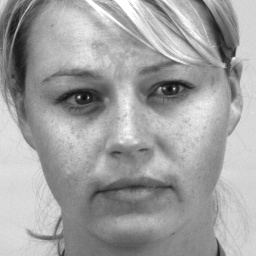
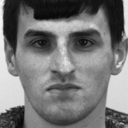
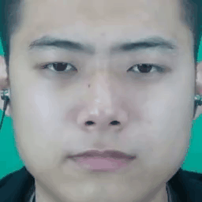
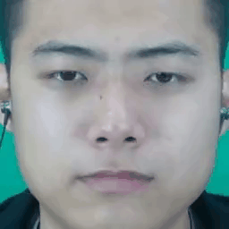

This repository contains the source code for the MEGC2022 with paper: Fine-grained Micro-Expression Generation based on Thin-Plate Spline and Relative AU Constraint 

And this work encouraged by [Thin-Plate-Spline-Motion-Model](https://github.com/yoyo-nb/Thin-Plate-Spline-Motion-Model).

## 0. Table of Contents
* [1. Authors & Maintainers](#1-authors---maintainers)
* [2. Quantitative Results](#2-quantitative-results)
* [2. Results in GIF](#3-results-in-gif)
* [4. Run the code](#4-run-the-code)
* [5. License](#5-license)
* [6. Citation](#6-citation)

## 1. Authors & Maintainers
Sirui et al.

## 2. Quantitative Results

## 3. Results in GIF
Given target template face:

the results of corresponding generation are listed below as gif.

| No.             | 1    | 2    | 3    | 4    | 5    | 6    | 7    | 8    | 9    |
| :-------------: | :--: | :--: | :--: | :--: | :--: | :--: | :--: | :--: | :--: | 
|  Source samples |  |  |  |  |  |  |  |  |  |
|  Our results    |  |  |  |  |  |  |  |  |  |

## 4. Run the code
`python run.py`

## 5. License
[MIT](https://github.com/Necolizer/Facial-Prior-Based-FOMM/blob/main/LICENSE)

## 6. Citation
Sirui Zhao, Shukang Yin, Huaying Tang, Jin Rijin, Yifan Xu, Tong Xu*, Enhong Chen, Fine-grained Micro-Expression Generation based on Thin-Plate Spline and Relative AU Constraint, In Proceedings of the 30th ACM International Conference on Multimedia (ACM MM'22), Lisbon, Portugal, 2022, Accepted，DOI: 10.1145/3503161.3551597.
